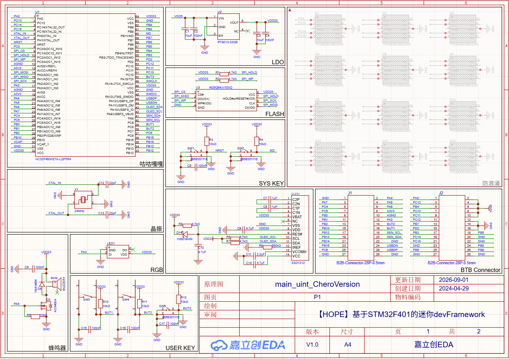
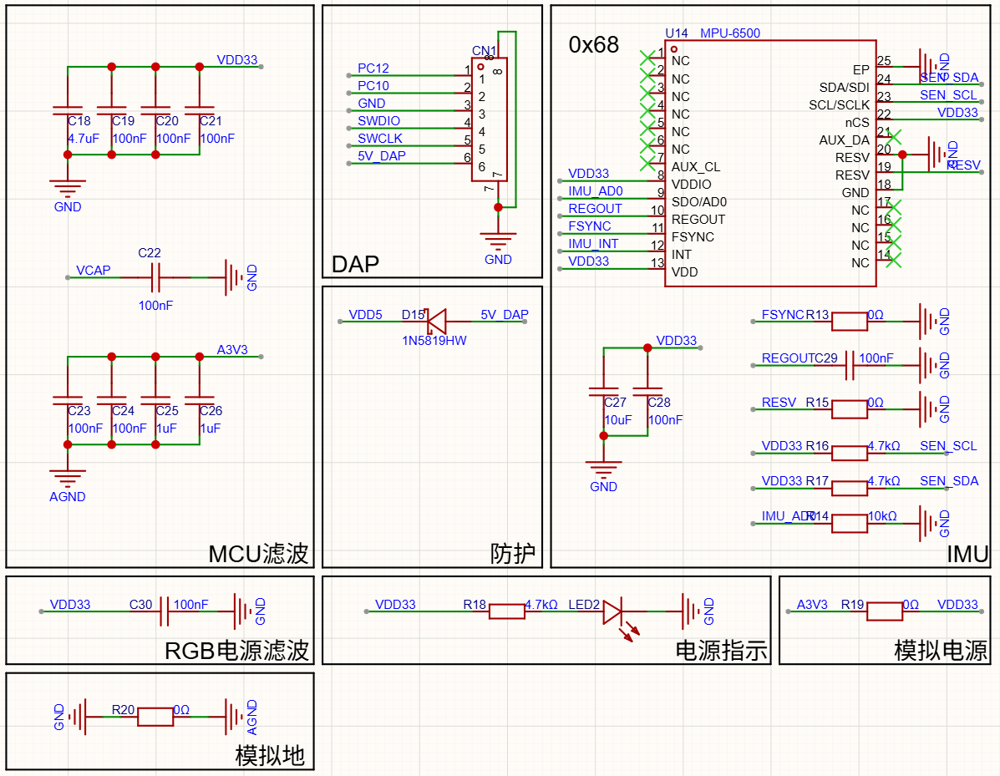
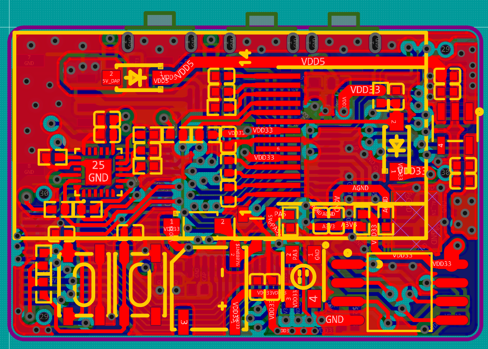
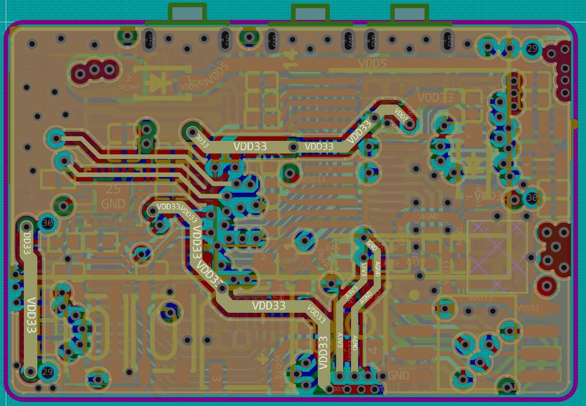
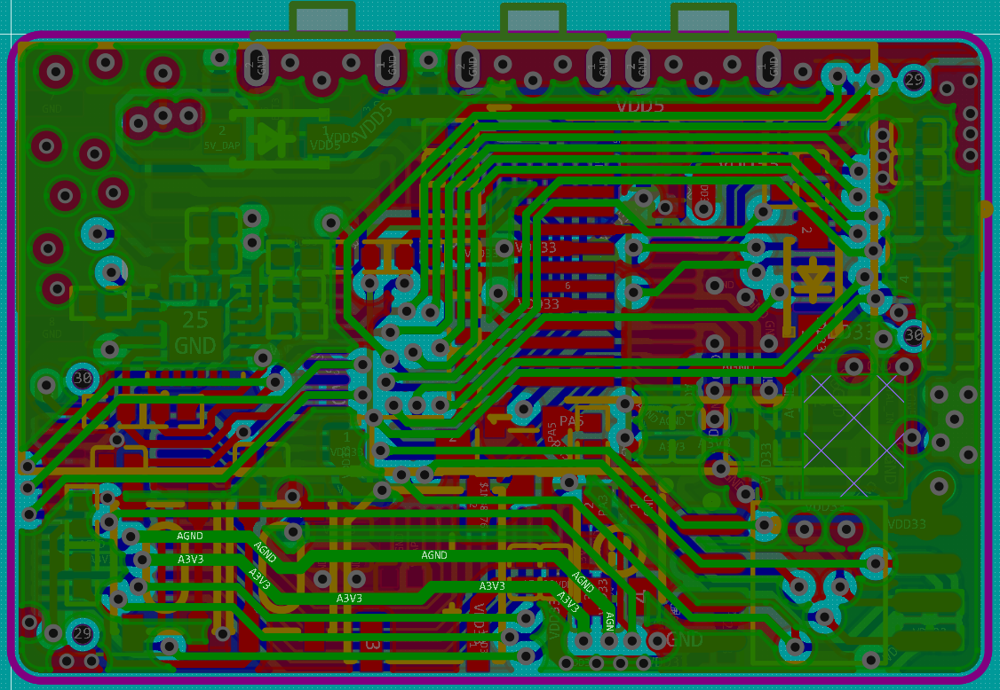
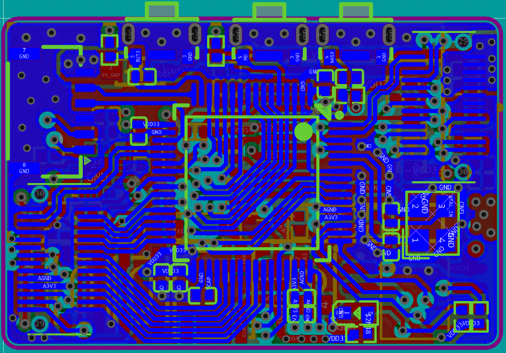
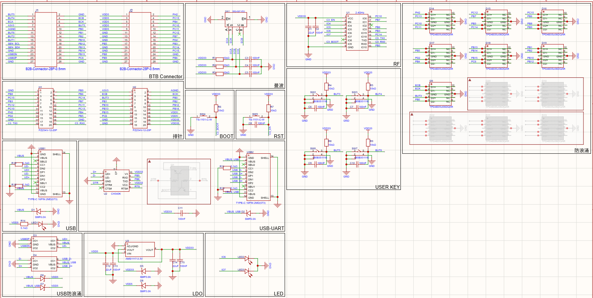
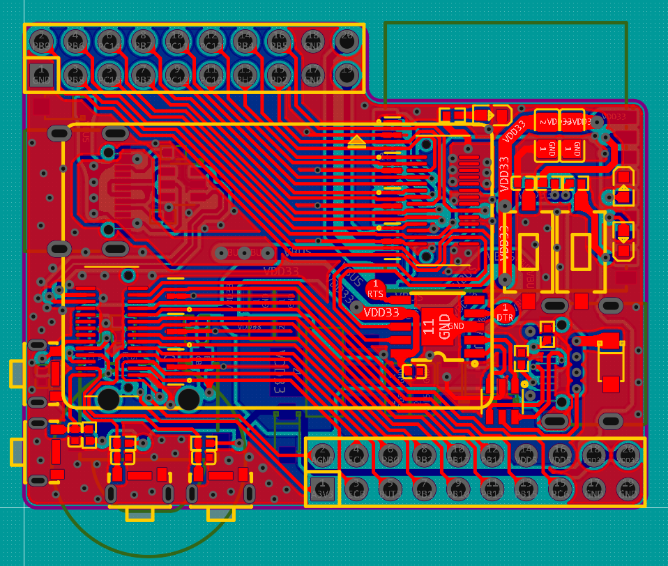
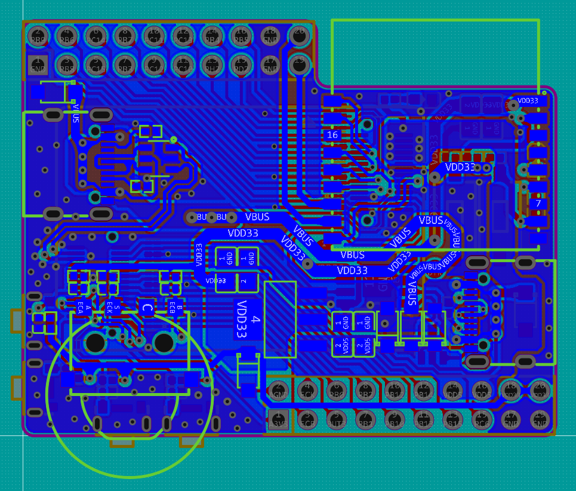

The HC32F460KETA-HOPE-KIT consists of a core board and a base board. The core board is equipped with an on-board MPU6050, OLED, buzzer, 16Mflash, RGB, buttons, and BTB connectors, facilitating rapid development. The base plate can be expanded with a variety of peripherals, including USB, UART, Bluetooth, rotary encoders, buttons, etc.

1.Physical picture of the core board

2.Physical picture of the expansion board

3.UI Function demonstration
Attention!!!!    This UI and idea are based on the KeLiang open-source project.And I ported this project based on the DDL library of HC32F460
The open source link is as follows.👇👇👇
https://oshwhub.com/hugego/hope-stm32f401-based-mini-devframework

4.schematic、pcb(This can be found in the "hardware" folder)
core board schematic

core board top layer

core board inner1 layer

core board inner2 layer

core board bottom layer

base board schematic

base board top layer

base board bottom layer

